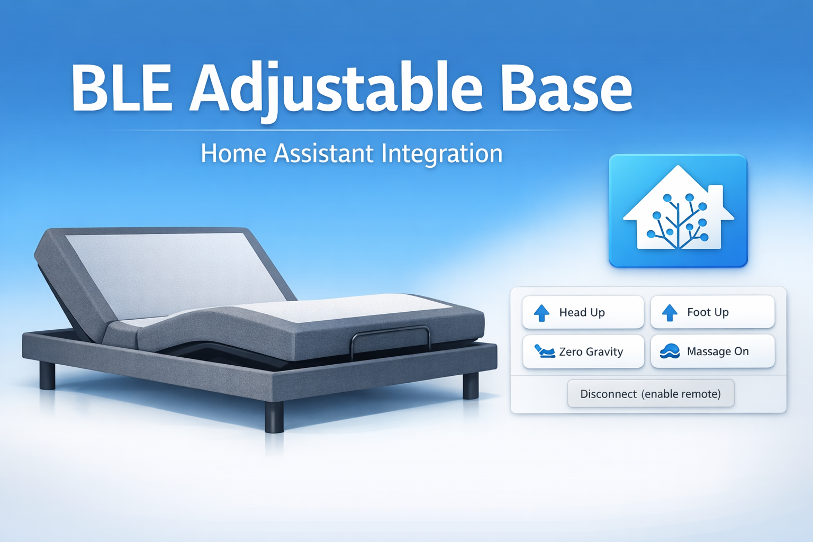

# Base Ajustable BLE (Mattress Firm 900) para Home Assistant

Un componente personalizado de Home Assistant para integrar la **Base Ajustable Mattress Firm 900** mediante **Bluetooth Low Energy (BLE)**.  
Esta integración permite el control local y la automatización de los ajustes de la cama sin depender de servicios en la nube.

---

## Antecedentes

La aplicación oficial para iOS **Mattress Firm M900** fue descontinuada y dejó de recibir soporte oficial en **diciembre de 2024**, dejando la base ajustable completamente funcional pero sin una solución inteligente mantenida activamente.

En **2020**, mientras la aplicación aún estaba disponible, observé y realicé ingeniería inversa de la comunicación Bluetooth Low Energy utilizada por la app M900. En ese momento confirmé que los mismos comandos podían replicarse de forma confiable utilizando una Raspberry Pi con Python y la librería Bleak.

Una vez verificado que los comandos funcionaban correctamente fuera de la aplicación móvil, el proyecto fue empaquetado como una integración para Home Assistant, permitiendo su instalación sencilla mediante **HACS** y su uso para automatización local.

Para mejorar el alcance y la estabilidad del Bluetooth, también implementé un proxy Bluetooth usando un ESP32 alimentado directamente desde el puerto USB de la base. Este paso es opcional, pero resulta muy útil si Home Assistant no se encuentra dentro de un rango Bluetooth confiable de la cama.

Esta integración se comunica **únicamente de forma local mediante BLE** y no depende de ninguna API en la nube.

---

## Funcionalidades

- Configuración mediante **Config Flow** (interfaz gráfica, sin YAML)
- Descubrimiento Bluetooth filtrado a dispositivos cuyo nombre comience con **`iFlex`**
- Conexión BLE confiable usando `bleak-retry-connector`
- Secuencia de **inicialización requerida** ejecutada automáticamente al conectar
- Entidades de tipo botón para:
  - Subir / bajar cabeza
  - Subir / bajar pies
  - Subir / bajar lumbar
  - Posiciones predefinidas (Plano, Gravedad Cero, Lounge, Inclinación, Anti-ronquidos)
  - Controles de masaje
  - Control de luz inferior:
    - **Luz (Cambiar color)**
    - **Apagar luz (Mantener presionado 3 segundos)** para imitar el control físico
- Desconexión automática para asegurar que el control remoto físico continúe funcionando
- Botón manual de **Desconectar**
- Registro RX opcional para depuración
- Operación completamente local
- Traducciones de interfaz en inglés y español

---

## Requisitos

- Home Assistant con soporte Bluetooth  
  (Se recomienda Home Assistant OS o Supervised)
- Base Ajustable Mattress Firm 900 (modelos iFlex con BLE)
- Opcional: ESP32 con ESPHome como proxy Bluetooth

---

## Instalación (HACS – Recomendado)

1. Abrir **HACS** en Home Assistant
2. Ir a **Integraciones**
3. Hacer clic en los **tres puntos (⋮)** en la esquina superior derecha
4. Seleccionar **Repositorios personalizados**
5. Agregar la URL del repositorio: https://github.com/daviddelahoz/BLEAdjustableBase
6. Seleccionar **Categoría: Integración**
7. Hacer clic en **Agregar**
8. Buscar **BLE Adjustable Base (Mattress Firm 900)** en HACS y hacer clic en **Descargar**
9. Reiniciar Home Assistant
10. Ir a **Configuración → Dispositivos y Servicios → Añadir Integración**
11. Buscar **BLE Adjustable Bed**

---

## Proxy Bluetooth (Opcional)

Si tu instancia de Home Assistant no se encuentra dentro de un rango Bluetooth confiable de la cama, puedes utilizar un proxy Bluetooth con un ESP32.

En esta configuración, el ESP32 puede alimentarse directamente desde el puerto USB integrado en la base, lo que proporciona excelente proximidad y estabilidad.

Consulta la documentación oficial de Home Assistant:
https://www.home-assistant.io/integrations/bluetooth/#bluetooth-proxies

---

## Notas y Limitaciones

- La base ajustable **no expone información de posición o ángulo en tiempo real** mediante BLE.
- Los comandos se envían de forma optimista, similar al control remoto físico y la aplicación original.
- Solo puede existir una conexión BLE activa a la vez.  
Si Home Assistant permanece conectado, el control remoto físico puede dejar de responder.
- Por esta razón, se incluye desconexión automática y un botón manual de **Desconectar**.

---

## Descargo de Responsabilidad

Este proyecto es una integración comunitaria independiente y **no está afiliado con Mattress Firm ni con ningún fabricante**.

Utilízalo bajo tu propia responsabilidad.

---

## Contribuciones

Los reportes de errores y solicitudes de mejora son bienvenidos.  
Si tienes una base ajustable similar que utilice diferentes comandos BLE, no dudes en abrir un issue y compartir los detalles.

---

📄 **English version available:** [README.md](README.md)